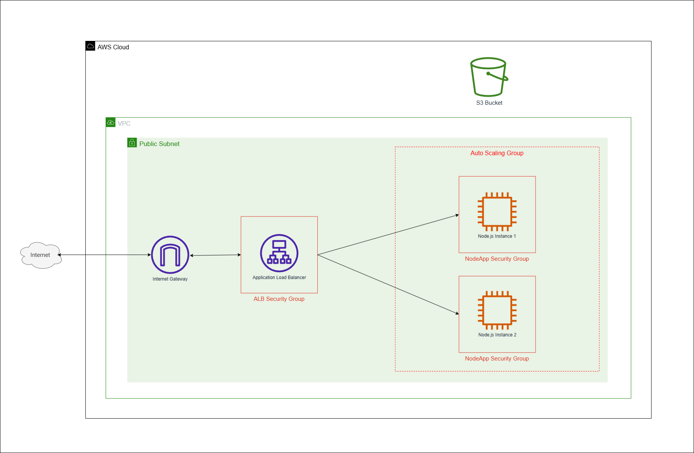

[](https://github.com/ishreyasp/terraform-hello-world-aws/actions/workflows/terraform-validations.yml)


# Terraform Hello World AWS Deployment

This repository contains Terraform configuration for deploying a simple Hello World Node.js API on AWS infrastructure using Auto Scaling Groups and Application Load Balancer.

## Key Components:

- VPC and Networking: Custom VPC with public subnets across multiple availability zones
- Auto Scaling Group: Maintains 2 EC2 instances running the application
- Application Load Balancer: Distributes traffic to healthy instances
- EC2 Instances: Ubuntu 22.04 instances running a Node.js Express application
- S3 Bucket: Secure storage for application data
- Security Groups: Controlled access to resources

## Prerequisites
Before you begin, ensure you have:

- AWS CLI installed and configured with appropriate credentials
- Terraform (v1.0.0+) installed
- Add the permisions for the AWS CLI user created as given in `aws-cli-user-permission.json`

## Architecture Diagram


## Description
Your project description here...

## Getting Started
### 1. Clone the Repository
    ```bash
    git clone https://github.com/yourusername/terraform-hello-world-aws.git
    cd terraform-hello-world-aws
    ```
### 2. Configure Terraform Variables

   - Create a `terraform.tfvars` file in the terraform directory
   - Edit the `terraform.tfvars` file with your specific values:
      - `aws_region`              = "your prefered region"
      - `access_key`                  = "your access key"
      - `secret_key`                  = "your secret key"
      - `vpc_cidr_block`              = "10.0.0.0/16"
      - `instance_tenancy`            = "default"
      - `az_state`                    = "available"
      - `subnet_cidrs`                = ["10.0.1.0/24", "10.0.2.0/24", "10.0.3.0/24"]
      - `subnet_count`                = 3
      - `rt_cidr_block`               = "0.0.0.0/0"
      - `ssh_port_cidr`               = ["0.0.0.0/0"]
      - `app_port`                    = "3000"
      - `egress_cidr`                 = ["0.0.0.0/0"]
      -  `http_port_cidr`              = ["0.0.0.0/0"]
      -  `alb_health_check_path`       = "/health"
      -  `ami_id`                      = "ami-0c3b809fcf2445b6a"
      -  `ec2_instance_type`           = "t2.micro"
      -  `volume_size`                 = 8
      -  `volume_type`                 = "gp2"
      -  `asg_cooldown_period`         = 60
      -  `asg_desired_capacity`        = 2
      -  `asg_grace_period`            = 300
      -  `asg_max_capacity`            = 3
      -  `asg_min_capacity`            = 2
      -  `s3_transition_days`          = 30
      -  `s3_transition_storage_class` = "STANDARD_IA"

### 3. Initialize Terraform
Initialize the Terraform working directory:
```bash
terraform init
```
This command downloads the required provider plugins and sets up the backend.

### 4. Format configuration files to a canonical style
```bash
terraform fmt -recursive
```

### 5. Check whether the configuration is syntactically valid
```bash
terraform validate
```

### 6. Plan the Deployment
Generate and review an execution plan:
```bash
terraform plan
```

This shows what actions Terraform will take to achieve the desired state in your configuration.

### 7. Apply the Configuration
Apply the Terraform configuration to create the resources:
```bash
terraform apply -var-file=terraform.tfvars
```

The deployment will take a few minutes. Once complete, Terraform will output important information like the ALB DNS name.

### 8. Access Your Application
After the deployment is complete, you can access your application using the ALB DNS name:
```bash
http://<alb_dns_name>
```

## Destroying Resources
To tear down all resources created by Terraform:
```bash
terraform destroy -var-file=terraform.tfvars
```

## Notes
- The EC2 instances are configured with a user data script that automatically installs and starts the Node.js application
- The application is managed as a systemd service for improved reliability
- The S3 bucket has lifecycle policies to transition objects to STANDARD_IA storage class after 30 days